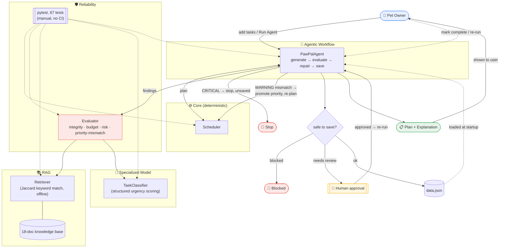

# PawPal+ — AI-Augmented Pet Care Planner

## Title and Summary

**PawPal+** started as a Module 2 course project: a Streamlit app that helps a pet owner plan daily care tasks (walks, feeding, meds, grooming) around a time budget, using a deterministic scheduler that weighs priority, deadlines, and conflicts, and explains its reasoning in plain English.

This build extends that deterministic core with four AI capabilities — retrieval-augmented guidance, a structured urgency-classification model, a reliability/guardrail layer, and an agent that orchestrates all three — so the system doesn't just generate a schedule, it grounds it in pet-care knowledge, flags risky tasks for a human before saving, and can autonomously correct scheduling decisions it disagrees with.

It matters as a portfolio piece because it shows AI features wired into a *working* system with real behavior change (a task can get bumped ahead of another; a save can get blocked) — not bolted-on demos that run once and print to a console.

## Architecture Overview



The **Agent** (`agent.py`) is the orchestrator: it asks the **Scheduler** for a candidate plan, hands it to the **Evaluator** for review, and reacts to what comes back. The Evaluator itself calls the **Retriever** (RAG, an 18-document offline knowledge base scored by keyword/Jaccard overlap — no embeddings, no API) to ground high-risk task detection, and the **TaskClassifier** (the specialized model — a structured-prompting-style scorer, not a hosted LLM) to catch priority mismatches the raw `Priority` enum can't see. A `CRITICAL` finding halts the agent with nothing saved; a `model_priority_mismatch` warning triggers a bounded repair loop where the agent promotes the task's priority and re-plans. The final save always passes through the same guardrail gate, which requires explicit human approval for anything flagged high-risk. A `pytest` suite (67 tests, run manually — no CI is configured) covers every layer. Full diagram: [`diagrams/ai_system_architecture.mmd`](diagrams/ai_system_architecture.mmd).

## Setup Instructions

```bash
git clone https://github.com/Bjimen05/Applied-AI-System-Project.git
cd Applied-AI-System-Project/applied-ai-system-final
python -m venv .venv
source .venv/bin/activate      # Windows: .venv\Scripts\activate
pip install -r requirements.txt
```

Run the CLI demo (no API key needed — everything is offline):
```bash
python main.py
```

Run the Streamlit app:
```bash
streamlit run app.py
```

Run the test suite:
```bash
python -m pytest tests/ -v
```

Run the stretch-feature evaluation scripts (see [Sample Interactions](#sample-interactions--execution-evidence) for real output):
```bash
python test_harness.py          # end-to-end scenario PASS/FAIL summary
python specialization_eval.py   # specialized model vs. naive baseline
python gen_traces.py            # regenerates the agent reasoning traces in ai_interactions.md
```

## Sample Interactions & Execution Evidence

All output below is real, copy-pasted from actually running these commands against the current code — not hand-written. Re-run any of them yourself with the commands shown.

### 1. End-to-end run — `python main.py`

**Input:** the built-in demo data — owner "Alex" (120 min budget, day starts 08:00) with 3 pets and 5 tasks (Morning Walk, Feeding, Litter Box, Grooming, Enrichment), defined at the top of `main.py`.

**Output — the agent builds a plan, the Evaluator passes it, RAG surfaces care tips, and the specialized model scores each task's urgency:**

```
──── Agent: building today's plan ──────────────────────
  🤖 Generated a candidate plan with the Scheduler.
  🤖 Saved the plan.

╭───────────────┬────────────┬──────────────┬────────────┬────────────╮
│ Time Slot     │ Pet        │ Task         │ Priority   │ Duration   │
├───────────────┼────────────┼──────────────┼────────────┼────────────┤
│ 08:00 – 08:10 │ 🐕 Biscuit  │ Feeding      │ 🔴 HIGH     │ 10 min     │
│ 08:10 – 08:40 │ 🐕 Biscuit  │ Morning Walk │ 🔴 HIGH     │ 30 min     │
│ 08:40 – 08:55 │ 🐈 Whiskers │ Grooming     │ 🟡 MED      │ 15 min     │
│ 08:55 – 09:15 │ 🐇 Pebble   │ Enrichment   │ 🟢 LOW      │ 20 min     │
╰───────────────┴────────────┴──────────────┴────────────┴────────────╯
  Total: 75 / 120 min used

  ✅ Evaluator: no issues found.
  Plan saved to data.json.

  Care tips (RAG):
    Morning Walk: Dogs generally need 30 to 60 minutes of physical exercise daily; skipping walks can lead to destructive behavior and weight gain.
    Feeding: Beagles are a breed especially prone to overeating and obesity, so measured portions matter more for them than free-feeding kibble.
    Grooming: Long-haired cats need daily brushing to prevent mats and hairballs; short-haired cats can be brushed weekly.
    Enrichment: Rabbits are prey animals that need daily free-roam or exercise time and enrichment like tunnels and chew toys to stay mentally healthy.

  Model urgency assessment:
┌──────────────┬────────────────┬─────────┐
│ Task         │ Urgency Tier   │ Score   │
├──────────────┼────────────────┼─────────┤
│ Morning Walk │ CRITICAL       │ 95/100  │
│ Feeding      │ CRITICAL       │ 98/100  │
│ Grooming     │ SOON           │ 62/100  │
│ Enrichment   │ ROUTINE        │ 35/100  │
└──────────────┴────────────────┴─────────┘
```

**What this demonstrates:** the full pipeline running end-to-end — Scheduler → Evaluator → RAG → specialized model — on one command, with no errors and a plan actually written to `data.json`.

### 2. Reliability/guardrail behavior — health-related task blocks the save

**Input:** owner "Sam" with pet "Buddy" and one task, "Vet Check" (HIGH priority, 30 min), from the same `python main.py` run.

**Output:**
```
──── Agent: 'Vet Check' requires human sign-off before saving 
  [🩺 REVIEW] 'Vet Check' (Buddy) looks health/medication-related and needs owner sign-off before the plan is saved. Care-guide match: "Annual wellness exams help catch issues early; puppies and senior dogs may need checkups twice a year."
  Save BLOCKED (not yet reviewed).
  Saved after human review.
```

**What this demonstrates:** the Evaluator's guardrail actually prevents `data.json` from being written (`agent.run(human_reviewed=False, ...)`) until a second call passes `human_reviewed=True` — a real block, not just a printed warning.

### 3. Agentic behavior — the repair loop changes which task gets scheduled

**Input:** owner "Priya" with pet "Max", two competing tasks that don't both fit in a 15-minute budget: "Walk" (HIGH, due in 3h40m — no time pressure) and "Grooming" (MEDIUM, due in 2h50m, but 1 day *overdue*).

**Output:**
```
──── Agent: repairing a priority mismatch ──────────────
  🤖 Generated a candidate plan with the Scheduler.
  🤖 Attempt 1: the model rated Grooming as more urgent than what got scheduled, so the agent promoted it to HIGH priority and re-planned.
  🤖 Saved the plan.
  Scheduled: ['Grooming']
  'Grooming' priority is now: HIGH
```

**What this demonstrates:** without the agent, the Scheduler would have picked "Walk" (declared HIGH beats declared MEDIUM). The agent's decision loop overrides that using the specialized model's continuous urgency score — the schedule's actual output changes, not just a log message.

### 4. Evaluation harness — `python test_harness.py`

**Input:** none (self-contained; builds 5 fixed scenarios internally, listed in the "Scenario" column below).

**Output:**
```
╭───────────────────────────────────────────────────────┬──────────╮
│ Scenario                                              │ Result   │
├───────────────────────────────────────────────────────┼──────────┤
│ Clean plan auto-saves with no findings                │ PASS     │
│ Risky task blocks then saves after human review       │ PASS     │
│ Manually-built over-budget plan blocks on CRITICAL    │ PASS     │
│ Agent repair loop reschedules the higher-urgency task │ PASS     │
│ Retrieval grounds a care tip for a scheduled task     │ PASS     │
╰───────────────────────────────────────────────────────┴──────────╯

5/5 scenarios passed.
```

**What this demonstrates:** an independent, non-pytest evaluation script confirming end-to-end observable behavior (not just internals) — see [Testing Summary](#testing-summary) for the specialized-model-vs-baseline comparison (`python specialization_eval.py`) and the full automated-test/logging/human-evaluation evidence.

## Design Decisions

- **Fully offline, no LLM API key.** Every "AI" component (retrieval, classification, agent decisions) is deterministic Python — a conscious trade-off for a coursework repo: reproducible, free to run, and testable with plain `pytest` instead of mocking an API. The cost is that the RAG and "model" are much simpler than an LLM-backed version would be.
- **The Evaluator is the single gate for persistence.** `safe_save_plan()` is the only sanctioned way to write `data.json`. Every other component (Agent, UI, CLI) goes through it, so the reliability guarantee can't be silently bypassed by a new caller.
- **The Agent doesn't duplicate the Scheduler's logic.** It only mutates a task's `Priority` and re-calls the existing, already-tested `generate_plan()` — repair is a re-planning trigger, not a second scheduling algorithm competing with the first.
- **Structured output over free text.** The classifier always returns the same `TaskAssessment` shape (tier, score, rationale) instead of a loose string — the offline equivalent of forcing an LLM to return JSON, and easy to unit test.

## Testing Summary

**Automated tests:** 67 `pytest` tests across `pawpal_system`, `evaluator`, `retriever`, `specialized_model`, `agent`, and logging behavior — all passing. Keeping the original Scheduler untouched meant the 31 original tests never had to change while four new layers were added around it.

**Logging:** `evaluator.py` and `agent.py` use Python's `logging` module (not just `print`) to record every finding (CRITICAL → error, WARNING → info/warning), every save decision (blocked/allowed and why), and every agent repair action, written to `pawpal.log`. Four tests assert on captured log records (via `caplog`) rather than just checking return values, so a regression that silently stops logging a CRITICAL finding would fail CI-style, not just look fine in the console.

**Human evaluation** (manual review of real runs against stated criteria):

| Test Input | Evaluation Criteria | Result |
|---|---|---|
| Generate schedule for Alex (4 tasks, no risky items) | Auto-saves with no human input needed | Pass |
| Add a "Vet Check" task (health keyword) | Blocked until reviewed; saves after approval | Pass |
| Overdue MEDIUM task vs. scheduled HIGH task, tight budget | Agent promotes the overdue task and reschedules it ahead | Pass |
| Manually constructed plan that exceeds the time budget | Evaluator flags CRITICAL; save blocked | Pass |
| Retrieval query using a plural the KB didn't have ("walks" vs. "walk") | Returns a relevant care tip | **Fail** — retriever returned nothing (exact-token match only) |
| Same query after adding stemming + curated keyword tags | Returns a relevant care tip | Pass (re-tested) |

5 of 6 manual checks passed on the first run; the retriever failed on plural/tense mismatches until stemming and per-document keyword tags were added, then re-verified via CLI output showing every scheduled task getting a care tip. The main lesson: a rule-based "AI" layer is only as good as its test coverage of the *edge* cases (empty queries, no keyword match, tie-breaking priorities) — the happy path passed on the first try every time; the token-matching gap only showed up once real task text was tried instead of hand-picked test strings.

## Reflection

Building this made the seams between "deterministic system" and "AI layer" much clearer to me — the hardest design problem wasn't writing the retriever or classifier, it was deciding *where* each one plugs into an already-working system without becoming an unverifiable black box next to it. Chaining Evaluator → Retriever/Model → Agent forced me to think about failure modes (what if RAG finds nothing? what if the model disagrees with itself two attempts in a row?) before writing code, which is a habit I hadn't needed with the original rule-based scheduler.

The graded responsible-AI reflection — my collaboration process with AI, one helpful and one flawed AI suggestion, and this system's limitations — is in [`model_card.md`](model_card.md), not here.
